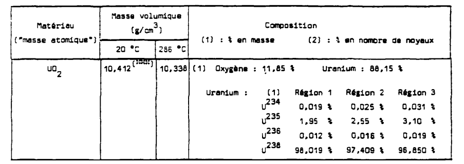
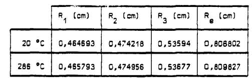
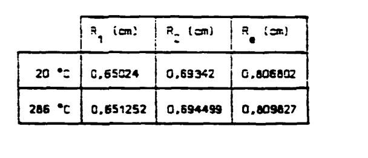

.. _exemple0:

################################
Simple Tihange exemple
################################

The data written in the file located at :file:`./data/Simplest.py` represent an light input designed to represent 15x15 pins Tihange-1 UO2 assembly.
This exemple is a reduced version of :file:`./data/Tihange.py` (1.95% UO2 with water-filled tubes).

The sources used to produce this inputs are :

- [1] `"Qualification du système NEPTUNE" <https://inis.iaea.org/collection/NCLCollectionStore/_Public/11/511/11511367.pdf>`_ -- CEA public note N-2092 by H.PANEK
- [2] `"In-core fuel management code package validation for PWRs" <https://inis.iaea.org/collection/NCLCollectionStore/_Public/26/077/26077395.pdf>`_ -- IAEA TECDOC-815
- [3] `"Incertitudes et ajustement des données nucléaires au moyen des méthodes déterministes, probabilistes et de mesures effectuées sur des REP" <https://publications.polymtl.ca/10545/>`_ -- Ecole Polytechnique de Montreal thesis by V.SALINO
- [4] `"LWR nuclear fuel bundle data for use in fuel bundle handling" <https://www.osti.gov/servlets/purl/5856990>`_ -- Pacific Northwest Laboratory note UC-85

This chapter gives a description of this file content. To get started::

  materials = pydrag.Materials(NuclearData = 'https://github.com/IRSN/PyNjoy2016/releases/download/JEFF-3.x/drglibJEFF-3.1.1')

This last line allows the user to call a specific nuclear data library. In this case, the library will be downloaded (from another Git repository, in this exemple). The Materials call will create a list of pre-defined mixtures.

.. code-block:: python
  :caption: Description of UO2 fuel mixture (temperature, density and composition)

  materials.set_tfuel(286.1111,'C')
  materials.UO2.set_density(10.96*0.95)
  materials.UO2.set_enrichment('U234', 0.00019)
  materials.UO2.set_enrichment('U235', 0.0195)
  materials.UO2.set_enrichment('U236', 0.00012)

Those composition are taken from reference [1] for the "Region 1" composition (p.154) :

The annotation on the UO2 density precises that 10.412 g/cm^3 represents 95% of the fuel density (which equals 10.96*0.95). The fuel temperature is set to 547°F (or 286.11°C, from the same reference).

.. code-block:: python
  :caption: Description of water mixture (which is the moderator)

  materials.water.set_temperature(286.1111,'C')
  materials.water.set_density(0.716403)
  materials.water.set_boron(600)

.. code-block:: python
  :caption: Description of Tihange grids

  materials.grids.set_fraction(1.175,'Inconel','tube')
  materials.grids.set_fraction(2.223,'SS304','tube')
  materials.grids.set_fraction(0.5496,'Inconel','fuel')
  materials.grids.set_fraction(4.166,'Inconel','gap')

.. code-block:: python
  :caption: Geometry made of 2 different pins (fuel F and tube T)

  F = ['UO2', 0.464693,
       'void', 0.474218,
       'Zr4', 0.53594] 
  T = ['water', 0.65024,
       'Zr4', 0.69342] 

These dimensions come from the reference [1] (p.153 and p.158):

.. note:
  
  The radii "Re" represent the equivalent radii used by the author in his own methdology. They are not used for the PyDrag calculation and geometry description. As a side note, the "void" radius is, in reality, made of Helium.

.. code-block:: python
  :caption: Geometry pin layout and assembly dimensions

  PinLayout = [[T, F, F, F, T, F, F, F],
                  [F, F, F, F, F, F, F],
                     [F, F, F, T, F, F],
                        [T, F, F, F, F],
                           [F, F, F, F],
                              [T, F, F],
                                 [F, F],
                                    [F]]
  geom = pydrag.Geometry(PinLayout,PinPitch = 1.4300201,AssemblyPitch = 21.50364,ActiveHeight = 365.76)

.. code-block:: python
  :caption: Assembly power density parameters

  powerDens = pydrag.Power(nbAssemblies = 157, corePower = 2652)

.. code-block:: python
  :caption: Tihange evolution calculation (with a Tihange-type grid dilution)

  burnup,kinf = pydrag.Deplete(materials, geom, powerDens,TypeDil = 'Tihange')

